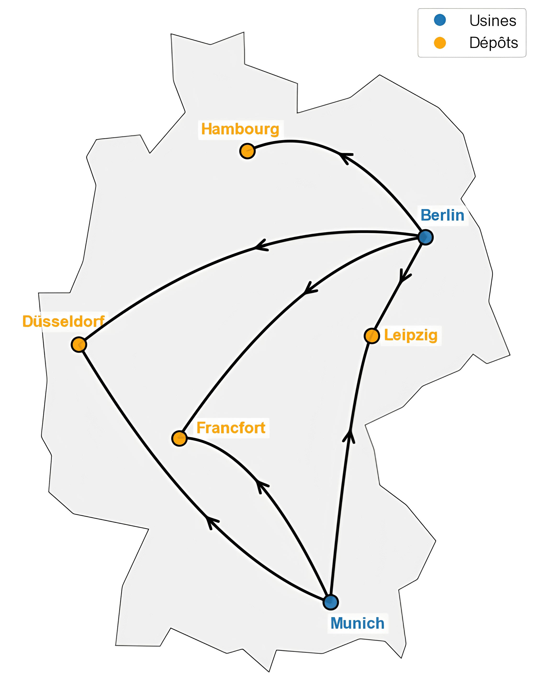

<div align="center">
  <h1>Optimisation de Réseau Logistique</h1>
  &nbsp;


  
  
  </div>

<p align="center">
  
</p>

Dans un contexte où la logistique est un enjeu stratégique pour les entreprises, l’optimisation des coûts de transport devient un levier essentiel pour améliorer la rentabilité et l’efficacité des flux de distribution. Ce projet propose une modélisation détaillée d’un problème de transport à l’aide du langage **AMPL**, avec plusieurs scénarios d’optimisation pour une entreprise allemande cherchant à approvisionner ses clients tout en minimisant ses coûts.

&nbsp;

## Le Langage AMPL  
AMPL (**A Mathematical Programming Language**) est un langage de modélisation utilisé pour résoudre des problèmes d’optimisation linéaire et non linéaire. Il permet une séparation claire entre :
- **Les données** (fichiers `.dat`),
- **Le modèle mathématique** (fichiers `.mod`),
- **Les commandes de résolution** (fichiers `.run`).  

Grâce à cette structure modulaire, AMPL facilite l'expérimentation avec différents solveurs comme **CPLEX** pour trouver des solutions optimales.

&nbsp;

## Objectifs du Projet  
L’étude explore différentes approches d’optimisation, incluant :
- **Minimisation des coûts de transport** entre usines, dépôts et clients.
- **Comparaison des stratégies de distribution**, avec ou sans entrepôts intermédiaires.
- **Intégration des préférences clients** pour adapter le réseau logistique à leurs exigences.
- **Réorganisation du réseau de dépôts**, en étudiant l’ouverture, l’extension ou la fermeture de certaines infrastructures.

### Visualisation du réseau

Voici la configuration géographique des usines et des dépôts, avec les flux de distribution réalisables de l'entreprise :

<p align="center">
  
</p>

&nbsp;

## Contenu du Rapport  
Le rapport présente une analyse approfondie du problème, avec :
- La **formulation mathématique** complète sous AMPL.
- Les **résultats des simulations**, illustrés par des tableaux et diagrammes de flux.
- Les **interprétations** sur les différentes stratégies logistiques.

Consulter le rapport :  
➡️ [Optimisation du Problème de Transport (PDF)](docs/Optimisation_Probleme_Transport.pdf)

&nbsp;

## Formulation Mathématique

Le modèle est formulé comme un problème de transport multi-étapes. L'objectif est de minimiser le coût total de distribution tout en respectant les capacités logistiques et les demandes clients.

### Fonction Objectif
L'objectif est de minimiser la fonction $Z$ représentant la somme des coûts sur les trois types de routes possibles (Usine $\to$ Client, Usine $\to$ Dépôt, Dépôt $\to$ Client) :

$$\begin{aligned}
\min Z = & \sum_{u \in U} \sum_{c \in C} \text{prix\_route}_{uc} \cdot \text{quantite\_UC}_{uc} \\
& + \sum_{u \in U} \sum_{d \in D} \text{prix\_route}_{ud} \cdot \text{quantite\_UD}_{ud} \\
& + \sum_{d \in D} \sum_{c \in C} \text{prix\_route}_{dc} \cdot \text{quantite\_DC}_{dc}
\end{aligned}$$

> Chaque variable $\text{quantite\_XY}_{xy}$ représente le **flux de marchandises** (en tonnes) acheminé d'un point $x \in X$ à un point $y \in Y$. Le modèle minimise ainsi le coût global en optimisant la répartition des flux sur l'ensemble du réseau.

### Contraintes Principales

* **Capacité des Usines ($U$) :** Le flux total sortant ne doit pas dépasser la capacité d'accueil/production.
    $$\sum_{c \in C} \text{quantite\_UC}_{uc} + \sum_{d \in D} \text{quantite\_UD}_{ud} \le \text{capacite\_accueil}_u, \quad \forall u \in U$$

* **Conservation des Flux (Dépôts $D$) :** Tout ce qui entre dans un dépôt doit en ressortir.
    $$\sum_{u \in U} \text{quantite\_UD}_{ud} = \sum_{c \in C} \text{quantite\_DC}_{dc}, \quad \forall d \in D$$

* **Satisfaction de la Demande (Clients $C$) :** La somme des livraisons directes et via dépôts doit égaler le besoin du client.
    $$\sum_{u \in U} \text{quantite\_UC}_{uc} + \sum_{d \in D} \text{quantite\_DC}_{dc} = \text{besoin\_client}_c, \quad \forall c \in C$$

&nbsp;

## Code et Modélisation  
Le projet est structuré en six fichiers de code (accessibles via [ce lien](src/)) :
- **`probleme_transport_partie1.mod`** : Modèle AMPL de base avec les dépôts initiaux.
- **`probleme_transport_partie1.dat`** : Données associées aux coûts de transport, capacités, demandes et préférences des clients. 
- **`probleme_transport_partie1.run`** : Commandes pour résoudre le modèle avec CPLEX. 
- **`probleme_transport_partie2.mod`** : Modèle AMPL intégrant les nouvelles options de dépôts. 
- **`probleme_transport_partie2.dat`** : Données mises à jour incluant les coûts d’ouverture, de fermeture et d'extension de dépôts.
- **`probleme_transport_partie2.run`** : Exécution de la simulation avec le solveur.

Les données utilisées dans ce projet ne proviennent pas d’un cas réel d’entreprise. Elles ont été générées de manière fictive mais cohérente, en s’appuyant sur des critères logistiques crédibles tels que les distances géographiques entre villes allemandes, des estimations réalistes de capacités, etc.

&nbsp;

## Installation et Exécution
1. Assurez-vous d'avoir **AMPL** et le solveur **CPLEX** installés.
2. Cloner le dépôt :
```bash
git clone https://github.com/rmdair/Optimisation_Probleme_Transport_AMPL.git
cd Optimisation_Probleme_Transport_AMPL
```

&nbsp;

## Références  
- AMPL Documentation officielle - *A Modeling Language for Mathematical Programming*  
  📖 [Lire le guide complet](https://ampl.com/wp-content/uploads/BOOK.pdf)
